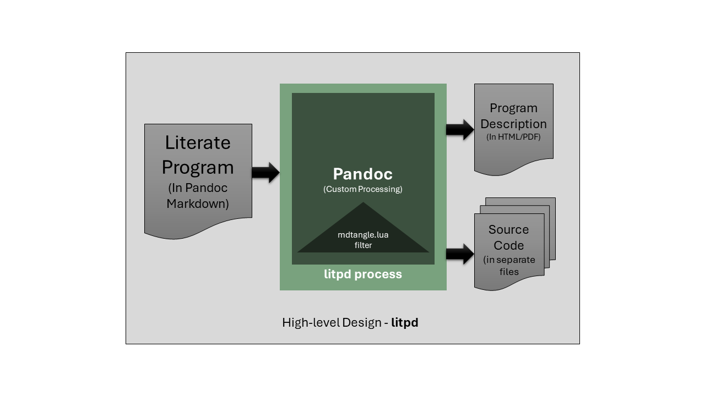

__Revisions__

|Version     |Date      |Comments                       |
|------------|----------|-------------------------------|
|0.1a-alpha.0|21/03/2024|Initial version                |
|0.1a-alpha.1|10/04/2024|Second alpha release, add code fragments with code_id support.|

# Introduction

This document describes a simple [literate programming][1] tool. It is
developed for use in my own programming projects. I use markdown for most
documentation, and I use `lua` for most of my programming needs these days.
This tool uses [pandoc][3] to process a markdown file to one of the supported
printable/publishable outputs supported by pandoc. The tool also includes
a lua filter to process the code blocks in the literate program document to
generate output programs in their own files.

This tool is itself written as a literate program and can be found at
[litpd][7]

## What is Literate Programming?

For those unfamiliar to the term "literate programming", I would refer you to
the excellent writings on the topic by [Donald Knuth][2]. In short literate
programming is about program definition in a document which is written as a work
of literature. Therefore one of the primary objectives of a literate program is
to be read and enjoyed by another programmer. The literate program document can
also be used to create an executable program or a library in the target
programming language.

[1]: https://en.wikipedia.org/wiki/Literate_programming
[3]: https://pandoc.org/
[2]: https://www-cs-faculty.stanford.edu/~knuth/lp.html
[7]: https://github.com/abhishekmishra/litpd

# The litpd Program

The litpd program is written in the [Lua programming language][4]. The goal of
the program is two-fold:

1. **Readable Program**: Generate a publishable/printable Program Description in
   HTML or PDF formats.
2. **Runnable Program**: Separate out and/or merge code blocks into individual
   program files so that they can be used as a normal program in the target
   language.

The program uses **pandoc** to perform the generation of the final readable
document with minor adjustments. Therefore this part of the program simply
delegates to pandoc.

To generate the source code in proper files and structure, we inject a lua
filter program into the pandoc processing flow. This program extracts the
code from the document and writes it to the target program file(s).

The approach is also described in the High-level design diagram below.



Therefore, the **litpd** application is composed of two programs.

1. **litpd.lua**: This program is the main cli tool used to generate the
   publishable document and the runnable program from the input literate
   program written in the [pandoc markdown format][5].
2. **mdtangle.lua**: This program is a [pandoc lua filter][6]. The goal of this
   program is to run during the filter phase of document generation and extract
   the source code of the literate program into proper output program files.

[4]: https://lua.org/about.html
[5]: https://pandoc.org/MANUAL.html#pandocs-markdown
[6]: https://pandoc.org/lua-filters.html

## CLI Program - litpd.lua

The `litpd.lua` program provides a command line interface to the literate
programming tool. It allows us to run the pandoc conversion of the literate
program document into the publishable document and the runnable program using
the `mdtangle.lua` filter as well as compile the output into proper files at
the proper locations.

The program has the following parts:

1. **Program documentation**
2. **Extract program arguments & check required arguments**
3. **Construct the pandoc command**
4. **Run the pandoc command and check for errors**

We will discuss each part one by one.

### Program Header

This part is self-explanatory and provides the header of the program
in standard lua documentation format.

```lua {code_file="litpd.lua"}
--- litpd.lua - Main CLI program for litpd tool.
--
-- license: MIT see LICENSE file
-- date: 21/03/2024
-- author: Abhishek Mishra
```

### Program Arguments

In this section of the program, we first construct the `args` table from the
program arguments.

* The `script_path` stores the first argument which is usually the name of
  the lua program being run, if this is run from a standard lua executable.
* In case the `script_path` contains any windows `\` backslash path separators,
  we replace them with `/` slashes.
* The we match anything before the last `\` of the `script_path` as the path
  of the directory containing the program, and store the result in `litmd_home`.
* Next we define a function `show_usage` which prints the usage of the command,
  this is used when the user does not pass the proper expected arguments to the
  command.
* Finally we look at the arguments:
  * If the length of the args is 0, then we print usage and exit.
  * If the first argument (i.e. the input literate programming document) is
    not provided, then we print the usage and exit. Else we store the input file
    name in `input_file`.
  * The rest of the arguments are assumed to be pandoc arguments and are stored
    in a separate table called `options`.

```lua {code_file="litpd.lua"}

-- get the arguments from the command line
local args = {...}

-- get the path of script, and its directory
local script_path = arg[0]
-- replace all backslashes with forward slashes
script_path = script_path:gsub("\\", "/")
local litmd_home = script_path:match(".*/")
-- print("litmd_home: " .. litmd_home)

--- Show usage
local function show_usage()
    print("Usage: litmd <inputfile.md> [options]")
end

-- if no arguments are provided, print the usage
if #args == 0 then
  show_usage()
  return
end

-- get the input file name
local input_file = args[1]
if input_file == nil then
    print("No input file provided")
    show_usage()
    return
end

-- get the rest of the arguments
local options = {}
for i = 2, #args do
    table.insert(options, args[i])
end
```

### Construct and Display Pandoc Command

In the next section of the program we now construct the pandoc command to run
such that both the output document, and output code are generated correctly.

* The `CODEID_FILTER` variable is created to store the path to the lua pandoc
  filter which will extract the code from the input document which are marked
  with code_id and write it to individual source code fragment files with the
  same name.
* The `TANGLE_FILTER` variable is created to store the path to the lua pandoc
  filter which will extract the code from the input document which are marked
  with code_file and write it to individual source code files.
* The `PANDOC_CMD` variable stores a string which passes the lua-filter arg and
  the markdown source type setting to the pandoc command.
* Then we construct the command to be run in a variable called `cmd` from its
  constituent parts. First the `PANDOC_CMD` then the `input_file` and finally
  the rest of the args in the table `options` are added to the string `cmd`.
* Once constructed the `cmd` string is displayed on the terminal.

```lua {code_file="litpd.lua"}

local CODEID_FILTER= litmd_home .. "codeidextract.lua"
local TANGLE_FILTER = litmd_home .. "mdtangle.lua"
local PANDOC_CMD = "pandoc" .. " --lua-filter=" .. 
            CODEID_FILTER .. " --lua-filter=" ..
            TANGLE_FILTER .. " --from=markdown "

-- create the final command, start with the pandoc command
local cmd = PANDOC_CMD
-- add the input file
cmd = cmd .. input_file
-- add the rest of the options
for i = 1, #options do
    cmd = cmd .. " " .. options[i]
end

-- display the command to be executed
print("Executing: " .. cmd)
```

### Run the Pandoc Command

The last few lines of the program run the constructed `cmd` string using
the `io.popen` library call. The call returns a handle to the output, which is
stored in `handle`. We read the output from this output stream into a variable
called `result` and then close the `handle`.

The `result` is printed to the terminal. And then the program is done.

```lua {code_file="litpd.lua"}

-- execute the command
local handle = io.popen(cmd)
if handle == nil then
    print("Error executing command")
    return
end
local result = handle:read("*a")
handle:close()
-- handle the result
print(result)
```

## Filter Program - codeidextract.lua

The `codeidextract.lua` program is a [pandoc lua filter][7]. A pandoc filter is
a program which is executed by the pandoc program during its filtration phase.
The filter has access to the abstract syntax tree (AST) of the input document.
The access to the AST of the input document provides the filter program the
ability to implement transformations of the input document, or add functionality
to the document generation process that is not part of the standard pandoc
processing.

The `codeidextract.lua` filter is interested in the CodeBlock section of the
AST of the input document which have an attribute named **code_id**. The value
of the attribute **code_id** is an identifier for the block of code in the
CodeBlock section of the document.

Once the author of the document creates a **code_id** CodeBlock he/she can
now reference this **code_id** in another CodeBlock. This allows us to build
entire programs from fragments of code in separated CodeBlocks. The document
introduces the separate parts of the program according to the flow of the ideas
in the document independent of how the source code will finally be placed in
the files.

Once the filter identifies a CodeBlock with a **code_id**, it extracts the code
into a separate temporary file assigned to each **code_id**.

```lua {code_file="codeidextract.lua"}

local codeidextract = {}

local function get_file_name (code_block)
    if code_block.attributes["code_id"] then
        return code_block.attributes["code_id"] .. '.tmp'
    end
end

local function get_file (code_block)
    local full_path = get_file_name(code_block)
    if full_path == nil then
        return nil, nil
    end
    local file = io.open(full_path, "w")
    return full_path, file
end

local function write_code_block (code_block, file)
    local code = code_block.text
    file:write(code)
    file:write("\n")
end

local function close_file (file)
  file:close()
end

function codeidextract.CodeBlock (code_block)
    local full_path, file = get_file(code_block)
    if full_path == nil then
        return
    end
    print("Extracting code id at " .. full_path)
    write_code_block(code_block, file)
    close_file(file)

    -- create a label for the code block if id exists
    local label_text = "id: " .. code_block.attributes["code_id"]
    return {
        pandoc.Strong(pandoc.Str(label_text)),
        code_block
    }
end

return {
    codeidextract
}
```

## Filter Program - mdtangle.lua

The `mdtangle.lua` program is also a [pandoc lua filter][7].

The `mdtangle.lua` filter is only interested in the `CodeBlock` section of the
AST which represents the code sections of the input markdown document. The
program registers itself to read all the `CodeBlock` sections. When a new code
block occurs, the filter program notes down its attribute named `code_file`.
If such an attribute exists then the code inside the `CodeBlock` is written
to the file at `code_file` in append mode.

Thus the effect of the filter is to take the code blocks from the literate
program and write them in their own target files.

Lets now look at the various parts of the program.

### Program Header

```lua {code_file="mdtangle.lua"}
--- md-tangle.lua - Lua filter for pandoc to tangle code blocks into one or more
-- files.
--
-- license: MIT see LICENSE file
-- date: 21/03/2024
-- author: Abhishek Mishra
```

### Module Declaration

The pandoc filter API expects a lua table to be returned from the program. The
table should contain entries for each AST node type that the filter intends to
process.

We define a table named `tangle` which will have just one entry `CodeBlock` by
the end of the program. `tangle` will be returned to pandoc as the definition
of the filter module.

```lua {code_file="mdtangle.lua"}

local tangle = {}

```

### Read `code_file` Attribute

As discussed earlier we have made one addition to the pandoc markdown format,
to support literate programming. Each code block which will be generated into
its own file must specify the output program file name in the fenced code block.
This output program file is specified as the value of a special attribute
`code_file` of the fenced code block.

The function `get_file_name` accepts a `code_block` value as argument. This
`code_block` is received by the `CodeBlock` handler in our program. Therefore it
is a pandoc object which has an `attributes` table.

The function retrieves the `code_file` value and stores it in `file_name`. If
there is no `code_file` defined for the fenced block, then its value is `nil`.

The `file_name` is returned to the caller.

```lua {code_file="mdtangle.lua"}

local function get_file_name (code_block)
    return code_block.attributes["code_file"]
end
```

### File I/O

The program defines three functions to perform I/O to the output program
file(s).

* `get_file`: Takes the `code_block` as argument, and gets the `full_path` of
  the file mentioned in the attributes of the fenced code blcok. The it opens a
  file in append node for the given `full_path`. Both `full_path` and `file` are
  returned to the caller.
* `write_code_block`: This function takes a `code_block` and a `file` already
  opened to write it. It writes the content of the `code_block` followed by a
  newline in the `file`.
* `close_file`: closes the given `file`.


```lua {code_file="mdtangle.lua"}

--- check if given path exists
---@param path string
---@return boolean
local function exists(path)
    local file = io.open(path, "r")
    if file then
        file:close()
        return true
    end
    return false
end

--- file contents
--@param path string
--@return string contents
local function file_contents(path)
    local file = io.open(path, "r")
    local contents = nil
    if file then
        contents = file:read("*all")
        file:close()
    end
    return contents
end

local function get_file (code_block)
    local full_path = get_file_name(code_block)
    if full_path == nil then
        return nil, nil
    end
    local file = io.open(full_path, "a")
    return full_path, file
end

local function write_code_block (code_block, file)
    local code = code_block.text

    local code_id_replace = true

    while code_id_replace do
      local t = {}
      local i = 0
      local found_code_id = false

      while true do
          local code_id
          i, _, code_id = string.find(code, "@<(%a+)@>", i+1)
          if i == nil then break end
          table.insert(t,
            {
              index = i,
              code_id = code_id
            }
          )
          found_code_id = true
      end

      for _, v in ipairs(t) do
          print('code id found at ', v.index, ' code_id = ', v.code_id)
          local cidfile = v.code_id .. '.tmp'
          if exists(cidfile) then
              print('file for code_id', v.code_id, 'exists at', cidfile)
              local contents = file_contents(cidfile)
              -- print(contents)
              code = code:gsub("@<" .. v.code_id .. "@>", contents)
          end
      end

      -- repeat the search only if there is a code_id found in current
      -- iteration, which means there might be more after replacement
      if not found_code_id then
         code_id_replace = false
      end
    end

    file:write(code)
    -- print(code)
    file:write("\n")
end

local function close_file (file)
    file:close()
end
```

### `CodeBlock` AST Hook

The `CodeBlock` function in the filter module will be called by pandoc when it
encounters a code block in the input markdown document. The only argument of
the function is `code_block` which gets the text of the code written in the
fenced code block.

* We retrieve the `full_path` to the `code_block`, and the corresponding
  writable `file` object using the `get_file` function defined above.
* If the returned `full_path` is `nil`, then there is nothing to do and the
  method returns.
* Otherwise the program writes the `code_block` to the `file` using the function
  `write_code_block`.
* Finally we close the `file` using the `close_file` function.

```lua {code_file="mdtangle.lua"}

function tangle.CodeBlock (code_block)
    local full_path, file = get_file(code_block)
    if full_path == nil then
        return
    end
    print("Tangling code block at " .. full_path)
    write_code_block(code_block, file)
    close_file(file)

    local label_text = "file: " .. full_path
    return {
        pandoc.Strong(pandoc.Str(label_text)),
        code_block
    }
end
```

### Module Export

Lastly, we export the module for use in pandoc.

```lua {code_file="mdtangle.lua"}

return {
    tangle
}
```

# Future Plans

This is a fairly new program. As I use it in my daily programming workflow,
I will make changes.

* **Version History**: All changes will be noted in the version history section
  at the top of the document.
* **Bug Fixes**: I've only uesd this to write a few programs, and therefore I'm
  sure there are several bugs lurking in the corners. They will be fixed, and
  the document updated accordingly.
* **New Features**: I see a few things which might be useful in the future.
  * **Out-of-order Code Blocks**: Currently the program files are generated with
    content in the order it appears in fenced code blocks in the input document.
    This is restrictive, and sometimes one might want to introduce program
    sections in a different sequence. This is a possible future enhancement.
  * **Ignore Code Blocks**: Some code blocks might just be examples or asides,
    and need not end up in the final program files. There should be a mechanism
    to ignore such code blocks.
