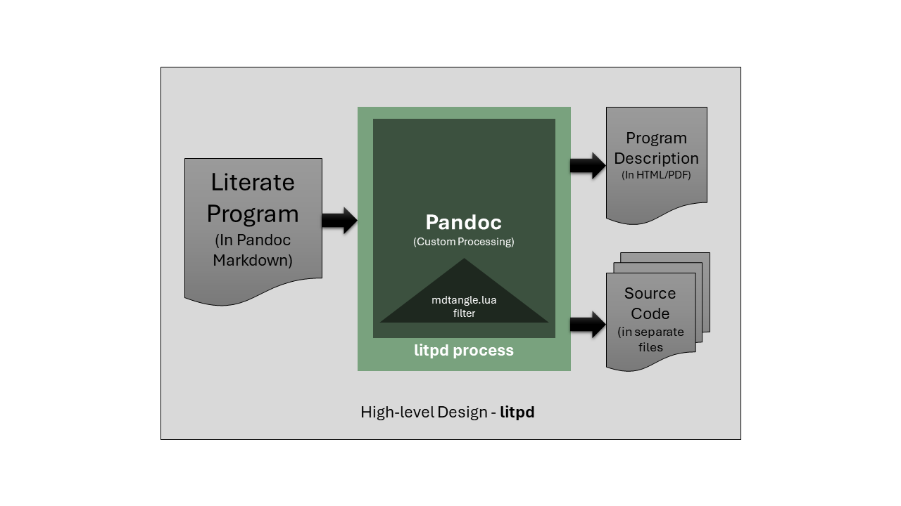

__Revisions__

|Version     |Date      |Comments                       |
|------------|----------|-------------------------------|
|0.1a-alpha.0|21/03/2024|Initial version                |
|0.1a-alpha.1|10/04/2024|Second alpha release, add code fragments with code_id support.|
|0.2.0-beta.0|18/05/2025|First beta release, support for powershell and bash scripts and installation procedure documented.|
|0.3.0-beta.0|01/09/2026|Replace the Lua, PowerShell, and Bash launchers with a cross-platform Python CLI.|

# Introduction

> 1. Write a program's code and design in markdown. 
> 2. Use litpd to generate the readable and runnable avatars of your program.
> 3. Profit?!!

This document describes a simple [literate programming][1] tool. It is
developed for use in my own programming projects. I use markdown for most
documentation, and I use `lua` for most of my programming needs these days.
This tool uses [pandoc][3] to process a markdown file to one of the supported
printable/publishable outputs supported by pandoc. The tool also includes
a lua filter to process the code blocks in the literate program document to
generate output programs in their own files.

This tool is itself written as a literate program and can be found at
[github/litpd][7]

## What is Literate Programming?

For those unfamiliar to the term "literate programming", I would refer you to
the excellent writings on the topic by [Donald Knuth][2]. In short literate
programming is about program definition in a document which is written as a work
of literature. Therefore one of the primary objectives of a literate program is
to be read and enjoyed by another programmer. The literate program document can
also be used to create an executable program or a library in the target
programming language.

[1]: https://en.wikipedia.org/wiki/Literate_programming
[3]: https://pandoc.org/
[2]: https://www-cs-faculty.stanford.edu/~knuth/lp.html
[7]: https://github.com/abhishekmishra/litpd

# Getting Started

To quickly get started with using the litpd program, follow the instructions to 
ensure you have the pre-requisites and then install and test the litpd release.

There are two pre-requisites:

1. Python 3.8 or newer
2. Pandoc (install the latest available for your platform)

The Lua filters are executed by Pandoc. A separate Lua installation is not
required.

## Installing Python

See the downloads page on the Python website for installation packages and
instructions -> [Python: Downloads](https://www.python.org/downloads/).

**Important: Ensure Python is added to the path after installation.**

## Installing Pandoc

See instructions for your platform at the pandoc website -> 
[Installing Pandoc](https://pandoc.org/installing.html).

**Important: Ensure pandoc is added to the path after installation**

## Installing litpd

1. Create litpd directory and change to it.
2. Download the latest release zip.
3. Unzip the release zip.

### Windows

```powershell
New-Item -ItemType Directory -Force -Name "litpd"; Set-Location "litpd"; Invoke-WebRequest -Uri "https://github.com/abhishekmishra/litpd/releases/latest/download/litpd.zip" -OutFile "litpd.zip"; Expand-Archive -Path "litpd.zip" -DestinationPath "."
```

### Linux/MacOS/Unix-like

```bash
mkdir -p litpd && cd litpd && curl -L -o litpd.tar.gz "https://github.com/abhishekmishra/litpd/releases/latest/download/litpd.tar.gz" && tar -xzf litpd.tar.gz
```

## Running litpd

In this section we will run litpd with the sample "Hello World!" program in the
file `helloworld.md` to generate the html readable program, and the helloworld
runnable programs in various programming languages.

_Open `helloworld.md` program in your favourite text editor to see what it looks
like._

### Windows

On Windows, run the Python program with the Python launcher:

```powershell
# Change to the litpd directory
cd litpd

# Run litpd with helloworld.md
py litpd.py helloworld.md
```

### Linux/MacOS/Unix-like

```bash
# Change to the litpd directory
cd litpd

# Run litpd with helloworld.md
python3 litpd.py helloworld.md
```

### Result

You should now see the following files:

1. `program.html`: This is the readable/printable version of the program.
2. `helloworld.lua,helloworld.py,etc.`: The runnable programs generated from
   `helloworld.md`.


# The litpd Program

The litpd command-line program is written in Python. Its Pandoc filters are
written in the [Lua programming language][4], the language supported by
Pandoc's built-in scripting engine. The goal of the program is two-fold:

1. **Readable Program**: Generate a publishable/printable Program Description in
   HTML or PDF formats.
2. **Runnable Program**: Separate out and/or merge code blocks into individual
   program files so that they can be used as a normal program in the target
   language.

The program uses **pandoc** to perform the generation of the final readable
document with minor adjustments. Therefore this part of the program simply
delegates to pandoc.

To generate the source code in proper files and structure, we inject a lua
filter program into the pandoc processing flow. This program extracts the
code from the document and writes it to the target program file(s).

The approach is also described in the High-level design diagram below.



## Components of litpd

As you have seen in the design diagram above, the litpd process uses pandoc
to generate both the readable and runnable avatars of the program. The user of
litpd interacts directly with the cross-platform Python program _litpd.py_.
This program ensures Pandoc is available, then starts Pandoc with the filter
programs _codeidextract.lua_ and _mdtangle.lua_ to get the runnable avatar of
the program. Since the input program is already in Pandoc
markdown format, pandoc can be used trivially to get the readable avatar of the
literate program.

Therefore, the **litpd** application is composed of the following components:

1. **litpd.py**: This program is the main CLI tool used to generate the
   publishable document and the runnable program from the input literate
   program written in the [pandoc markdown format][5].
2. **mdtangle.lua**: This program is a [pandoc lua filter][6]. The goal of this
   program is to run during the filter phase of document generation and extract
   the source code of the literate program into proper output program files.
3. **codeidextract.lua**: This program is also a [pandoc lua filter][6]. The
   goal of this program is to use the file id's or code id's of the program
   fragments and load the appropriate code-blocks for each.

[4]: https://lua.org/about.html
[5]: https://pandoc.org/MANUAL.html#pandocs-markdown
[6]: https://pandoc.org/lua-filters.html

## CLI Program - litpd.py

The `litpd.py` program provides a command line interface to the literate
programming tool. It allows us to run the pandoc conversion of the literate
program document into the publishable document and the runnable program using
the `mdtangle.lua` filter as well as compile the output into proper files at
the proper locations.

The program has the following parts:

1. **Program documentation**
2. **Extract program arguments and check prerequisites**
3. **Construct the pandoc command**
4. **Run the pandoc command and check for errors**

We will discuss each part one by one.

### Program Header

The Python standard library provides everything required by the CLI. `Path` is
used for reliable cross-platform paths, `shutil` locates Pandoc, and
`subprocess` runs it without invoking a command shell.

```python {code_file="litpd.py"}
#!/usr/bin/env python3
"""Command-line interface for litpd."""

from __future__ import annotations

import shlex
import shutil
import subprocess
import sys
from pathlib import Path
```

### Program Arguments

The first argument is the input literate-programming document. Any remaining
arguments are passed to Pandoc unchanged. If no Pandoc options are supplied,
litpd generates `program.html` by default.

```python {code_file="litpd.py"}

VERSION = "0.3.0-beta.0"
USAGE = "Usage: litpd.py <inputfile.md> [pandoc options]"


def main(args: list[str]) -> int:
    if args and args[0] in {"-V", "--version"}:
        print(f"litpd {VERSION}")
        return 0

    if not args or args[0] in {"-h", "--help"}:
        print(USAGE)
        return 0 if args else 2

    input_file = Path(args[0])
    if not input_file.is_file():
        print(f"Error: input file not found: {input_file}", file=sys.stderr)
        return 2

    pandoc = shutil.which("pandoc")
    if pandoc is None:
        print(
            "Error: Pandoc was not found. Install Pandoc and ensure it is in PATH.",
            file=sys.stderr,
        )
        return 127

    options = args[1:] or ["--output=program.html"]
```

### Construct and Display Pandoc Command

In the next section of the program we now construct the pandoc command to run
such that both the output document, and output code are generated correctly.

* The `codeid_filter` variable is created to store the path to the Lua Pandoc
  filter which will extract the code from the input document which are marked
  with code_id and write it to individual source code fragment files with the
  same name.
* The `tangle_filter` variable stores the path to the Lua Pandoc
  filter which will extract the code from the input document which are marked
  with code_file and write it to individual source code files.
* The command is constructed as a list of arguments. This preserves spaces and
  other characters in filenames and prevents a shell from interpreting user
  input.

```python {code_file="litpd.py"}

    litpd_home = Path(__file__).resolve().parent
    codeid_filter = litpd_home / "codeidextract.lua"
    tangle_filter = litpd_home / "mdtangle.lua"

    for filter_file in (codeid_filter, tangle_filter):
        if not filter_file.is_file():
            print(f"Error: required filter not found: {filter_file}", file=sys.stderr)
            return 2

    command = [
        pandoc,
        f"--lua-filter={codeid_filter}",
        f"--lua-filter={tangle_filter}",
        "--from=markdown",
        str(input_file),
        *options,
    ]

    print("Executing:", shlex.join(command))
```

### Run the Pandoc Command

`subprocess.run` connects Pandoc directly to the terminal. A Pandoc failure is
returned to the caller as the CLI's exit status, making failures visible to
scripts, build systems, and continuous integration.

```python {code_file="litpd.py"}

    try:
        completed = subprocess.run(command, check=False)
    except OSError as error:
        print(f"Error: could not start Pandoc: {error}", file=sys.stderr)
        return 1

    return completed.returncode


if __name__ == "__main__":
    raise SystemExit(main(sys.argv[1:]))
```

## Filter Program - codeidextract.lua

The `codeidextract.lua` program is a [pandoc lua filter][7]. A pandoc filter is
a program which is executed by the pandoc program during its filtration phase.
The filter has access to the abstract syntax tree (AST) of the input document.
The access to the AST of the input document provides the filter program the
ability to implement transformations of the input document, or add functionality
to the document generation process that is not part of the standard pandoc
processing.

The `codeidextract.lua` filter is interested in the CodeBlock section of the
AST of the input document which have an attribute named **code_id**. The value
of the attribute **code_id** is an identifier for the block of code in the
CodeBlock section of the document.

Once the author of the document creates a **code_id** CodeBlock he/she can
now reference this **code_id** in another CodeBlock. This allows us to build
entire programs from fragments of code in separated CodeBlocks. The document
introduces the separate parts of the program according to the flow of the ideas
in the document independent of how the source code will finally be placed in
the files.

Once the filter identifies a CodeBlock with a **code_id**, it extracts the code
into a separate temporary file assigned to each **code_id**.

```lua {code_file="codeidextract.lua"}

local codeidextract = {}

local function get_file_name (code_block)
    if code_block.attributes["code_id"] then
        return code_block.attributes["code_id"] .. '.tmp'
    end
end

local function get_file (code_block)
    local full_path = get_file_name(code_block)
    if full_path == nil then
        return nil, nil
    end
    local file = io.open(full_path, "w")
    return full_path, file
end

local function write_code_block (code_block, file)
    local code = code_block.text
    file:write(code)
    file:write("\n")
end

local function close_file (file)
  file:close()
end

function codeidextract.CodeBlock (code_block)
    local full_path, file = get_file(code_block)
    if full_path == nil then
        return
    end
    print("Extracting code id at " .. full_path)
    write_code_block(code_block, file)
    close_file(file)

    -- create a label for the code block if id exists
    local label_text = "id: " .. code_block.attributes["code_id"]
    return {
        pandoc.Strong(pandoc.Str(label_text)),
        code_block
    }
end

return {
    codeidextract
}
```

## Filter Program - mdtangle.lua

The `mdtangle.lua` program is also a [pandoc lua filter][7].

The `mdtangle.lua` filter is only interested in the `CodeBlock` section of the
AST which represents the code sections of the input markdown document. The
program registers itself to read all the `CodeBlock` sections. When a new code
block occurs, the filter program notes down its attribute named `code_file`.
If such an attribute exists then the code inside the `CodeBlock` is written
to the file at `code_file` in append mode.

Thus the effect of the filter is to take the code blocks from the literate
program and write them in their own target files.

Lets now look at the various parts of the program.

### Program Header

```lua {code_file="mdtangle.lua"}
--- md-tangle.lua - Lua filter for pandoc to tangle code blocks into one or more
-- files.
--
-- license: MIT see LICENSE file
-- date: 21/03/2024
-- author: Abhishek Mishra
```

### Module Declaration

The pandoc filter API expects a lua table to be returned from the program. The
table should contain entries for each AST node type that the filter intends to
process.

We define a table named `tangle` which will have just one entry `CodeBlock` by
the end of the program. `tangle` will be returned to pandoc as the definition
of the filter module.

```lua {code_file="mdtangle.lua"}

local tangle = {}

```

### Read `code_file` Attribute

As discussed earlier we have made one addition to the pandoc markdown format,
to support literate programming. Each code block which will be generated into
its own file must specify the output program file name in the fenced code block.
This output program file is specified as the value of a special attribute
`code_file` of the fenced code block.

The function `get_file_name` accepts a `code_block` value as argument. This
`code_block` is received by the `CodeBlock` handler in our program. Therefore it
is a pandoc object which has an `attributes` table.

The function retrieves the `code_file` value and stores it in `file_name`. If
there is no `code_file` defined for the fenced block, then its value is `nil`.

The `file_name` is returned to the caller.

```lua {code_file="mdtangle.lua"}

local function get_file_name (code_block)
    return code_block.attributes["code_file"]
end
```

### File I/O

The program defines three functions to perform I/O to the output program
file(s).

* `get_file`: Takes the `code_block` as argument, and gets the `full_path` of
  the file mentioned in the attributes of the fenced code blcok. The it opens a
  file in append node for the given `full_path`. Both `full_path` and `file` are
  returned to the caller.
* `write_code_block`: This function takes a `code_block` and a `file` already
  opened to write it. It writes the content of the `code_block` followed by a
  newline in the `file`.
* `close_file`: closes the given `file`.


```lua {code_file="mdtangle.lua"}

--- check if given path exists
---@param path string
---@return boolean
local function exists(path)
    local file = io.open(path, "r")
    if file then
        file:close()
        return true
    end
    return false
end

--- file contents
--@param path string
--@return string contents
local function file_contents(path)
    local file = io.open(path, "r")
    local contents = nil
    if file then
        contents = file:read("*all")
        file:close()
    end
    return contents
end

local function get_file (code_block)
    local full_path = get_file_name(code_block)
    if full_path == nil then
        return nil, nil
    end
    local file = io.open(full_path, "a")
    return full_path, file
end

local function write_code_block (code_block, file)
    local code = code_block.text

    local code_id_replace = true

    while code_id_replace do
      local t = {}
      local i = 0
      local found_code_id = false

      while true do
          local code_id
          i, _, code_id = string.find(code, "@<(%a+)@>", i+1)
          if i == nil then break end
          table.insert(t,
            {
              index = i,
              code_id = code_id
            }
          )
          found_code_id = true
      end

      for _, v in ipairs(t) do
          print('code id found at ', v.index, ' code_id = ', v.code_id)
          local cidfile = v.code_id .. '.tmp'
          if exists(cidfile) then
              print('file for code_id', v.code_id, 'exists at', cidfile)
              local contents = file_contents(cidfile)
              -- print(contents)
              code = code:gsub("@<" .. v.code_id .. "@>", contents)
          end
      end

      -- repeat the search only if there is a code_id found in current
      -- iteration, which means there might be more after replacement
      if not found_code_id then
         code_id_replace = false
      end
    end

    file:write(code)
    -- print(code)
    file:write("\n")
end

local function close_file (file)
    file:close()
end
```

### `CodeBlock` AST Hook

The `CodeBlock` function in the filter module will be called by pandoc when it
encounters a code block in the input markdown document. The only argument of
the function is `code_block` which gets the text of the code written in the
fenced code block.

* We retrieve the `full_path` to the `code_block`, and the corresponding
  writable `file` object using the `get_file` function defined above.
* If the returned `full_path` is `nil`, then there is nothing to do and the
  method returns.
* Otherwise the program writes the `code_block` to the `file` using the function
  `write_code_block`.
* Finally we close the `file` using the `close_file` function.

```lua {code_file="mdtangle.lua"}

function tangle.CodeBlock (code_block)
    local full_path, file = get_file(code_block)
    if full_path == nil then
        return
    end
    print("Tangling code block at " .. full_path)
    write_code_block(code_block, file)
    close_file(file)

    local label_text = "file: " .. full_path
    return {
        pandoc.Strong(pandoc.Str(label_text)),
        code_block
    }
end
```

### Module Export

Lastly, we export the module for use in pandoc.

```lua {code_file="mdtangle.lua"}

return {
    tangle
}
```

# Future Plans

This is a fairly new program. As I use it in my daily programming workflow,
I will make changes.

* **Version History**: All changes will be noted in the version history section
  at the top of the document.
* **Bug Fixes**: I've only uesd this to write a few programs, and therefore I'm
  sure there are several bugs lurking in the corners. They will be fixed, and
  the document updated accordingly.
* **New Features**: I see a few things which might be useful in the future.
  * **Ignore Code Blocks**: Some code blocks might just be examples or asides,
    and need not end up in the final program files. There should be a mechanism
    to ignore such code blocks.
